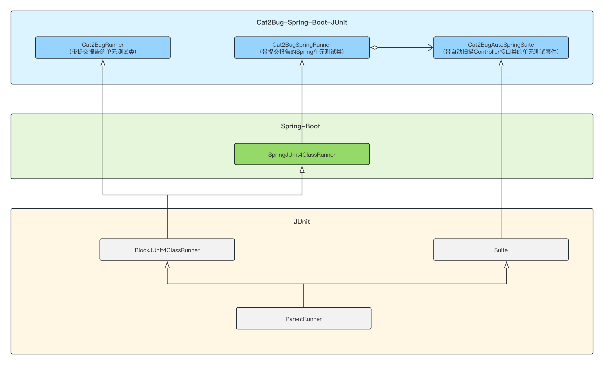
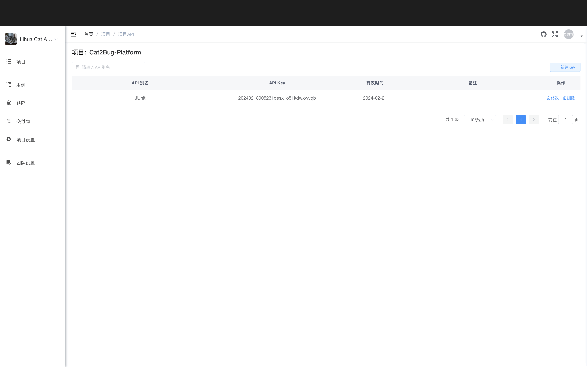

# Cat2Cug-Spring-Boot-JUnit

## 介绍
[Cat2Cug-Spring-Boot-JUnit](https://gitee.com/cat2bug/cat2bug-spring-boot-junit) 是[Cat2Bug](https://www.cat2bug.com) 推出的Java Spring单元测试功能包，目标是用最少的代码完成单元测试，减少开发人员在单元测试过程中的代码开发量，并可将测试结果发送到开源缺陷管理平台[Cat2Bug-Platform](https://gitee.com/cat2bug/cat2bug-platform) 上，提高软件开发、Bug修复及项目管理交付的效率。

## 连接
* 官网: https://www.cat2bug.com
* library github: https://github.com/cat2bug/cat2bug-junit
* library gitee: https://gitee.com/cat2bug/cat2bug-junit

## 软件架构

Cat2Cug-Spring-Boot-JUnit 以Spring Boot 2、JUnit 4 为基础,添加测试报告推送、扫包自动创建测试类功能，使开发人员可以通过添加简单注解快速进行单元测试。



## 安装

*  Gradle
```javascript
testImplementation ("com.cat2bug:cat2bug-spring-boot-junit:0.0.2")
```

* Maven

```javascript
<dependency>
    <groupId>com.cat2bug</groupId>
    <artifactId>cat2bug-spring-boot-junit</artifactId>
    <version>0.0.2</version>
    <scope>test</scope>
</dependency>
```

## 使用说明

### 测试前的准备

如果需要在单元测试完成后，将测试失败的缺陷结果提交到BUG系统，需先部署[Cat2Bug-Platform](https://gitee.com/cat2bug/cat2bug-platform)平台，并设置API KEY，以下介绍一种快速部署方式，更多详情请参阅[Cat2Bug官网文档](https://www.cat2bug.com)。

1. Docker下载[Cat2Bug-Platform容器](https://hub.docker.com/r/cat2bug/cat2bug-platform)平台部署，执行代码如下：
````
docker run -it -d -p 8022:8022 --name cat2bug-platform cat2bug/cat2bug-platform:latest
````

启动成功后，在浏览器访问http://127.0.0.1:8022， 如果可以正常访问，代表平台启动成功；

2. 在[Cat2Bug-Platform](https://gitee.com/cat2bug/cat2bug-platform)平台,依次注册用户，创建团队，创建项目后，在项目设置的API KEY中，添加一个KEY，用于单元测试提交报告的鉴权用，界面如下：



至此，准备工作已经完成。

## API说明

在项目中引用cat2bug-spring-boot-junit包后，在测试类中添加简单配置，即可自动扫描测试，大家可以参考源码中的demo，下面将介绍相关注解API。

### AutoTestScan 类注解

**用能：**  
用于指定自动测试哪些包下的Controller类。

**参数说明：**

| 参数名         | 类型  | 是否必填 | 功能描述      |
|---|---|---|---|
| packageName | 字符串 | 是 | 指定扫描的包名称。 |

### PushDefect 类注解
**用能：**  
在测试完成后，将失败的测试结果发送到[Cat2Bug-Platform](https://gitee.com/cat2bug/cat2bug-platform)。  
**参数说明：**

| 参数名        | 类型  | 是否必填  | 功能描述                                                      |
|------------|---|---|-----------------------------------------------------------|
| host       | 字符串 | 是 | Cat2Bug-Platform平台的网址。                                    |
| projectKey | 字符串 | 是 | 应用配置中的Key。                                                |
| handler    | 字符串 | 是 | 问题处理人的登陆名。                                                |
| isPush     | 布尔型 | 否 | 是否推送问题报告到[Cat2Bug云平台](https://www.cat2bug.com)，默认值为true推送。 |

### RandomParameter 方法注解
**用能：**  
此注解需要与@RunWith(Cat2BugAutoSpringSuite)一起配合使用，Cat2BugAutoSpringSuite类用来扫描功能类后动态创建测试用例，RandomParameter用于计算某个测试方法的参数值。当用户没有实现RandomParameter时，测试方法的参数会根据数据类型随机赋值。  
**参数说明：**

| 参数名         | 类型  | 是否必填  | 功能描述      |
|---|---|---|---|
| className | 正则表达式 | 否 | 指明哪个测试类名接收此方法的返回值，如果为空，代表所有测试类都接收此值。 |
| methodName | 正则表达式 | 否 | 指明哪个测试方法名接收此方法的返回值，如果为空，代表所有测试方法都接收此值。  | 
| parameterName | 正则表达式 | 是 | 指明测试方法中的哪个参数名接收此方法的返回值。 |   

在测试一些业务功能时，如删除指定Id的数据信息，这时需要传递指定的Id值做为参数，采用随机赋值测试的方法就行不通了，此时就可以通过RandomParameter注解，指定哪一个测试类、哪一个测试方法的哪个参数来返回这个固定Id值。  
另外需要注意RandomParameter注解的方法必须有返回值。
### Cat2BugRunner 类
Cat2BugRunner注解继承于BlockJUnit4ClassRunner类，主要功能用于在测试完成后，将测试结果上传到[Cat2Bug云平台](https://www.cat2bug.com)。此注解需要配合PushDefect注解一起使用，才能提交报告。

```java
@RunWith(Cat2BugRunner.class)
@PushDefect(host = "http://127.0.0.1:8022", projectKey = "********-****-****-****-********", handler="处理用户登陆名")
public class Cat2BugRunnerTest {
	@Test
	public void testFalse() {
		Assert.assertTrue(false);
	}
}
```

### Cat2BugSpringRunner 类

Cat2BugSpringRunner继承于SpringJUnit4ClassRunner类，功能与Cat2BugRunner类相同，主要用于在测试完成后，将测试结果上传到[Cat2Bug云平台](https://www.cat2bug.com)。

```java
@RunWith(Cat2BugSpringRunner.class)
@PushDefect(host = "http://127.0.0.1:8022", projectKey = "********-****-****-****-********",handler="处理用户登陆名")
@WebAppConfiguration
@SpringBootTest
public class Cat2BugSpringRunnerTest {
	private MockMvc mock;
	@Autowired
	private WebApplicationContext webContext;
	
	@Before
	public void init() {
		mock = org.springframework.test.web.servlet.setup.MockMvcBuilders.webAppContextSetup(webContext).build();
	}
	
	@Test
	public void testGetAllUsers() throws Exception {
		MockHttpServletRequestBuilder builder = MockMvcRequestBuilders.get("/users")
				.contentType(MediaType.APPLICATION_JSON);
		mock.perform(builder).andExpect(MockMvcResultMatchers.status().isOk())
				.andDo(MockMvcResultHandlers.print())
				.andReturn().getResponse().getContentAsString();
	}
}
```

### Cat2BugAutoSpringSuite 类
Cat2BugAutoSpringSuite继承于Suite套件类，测试时会扫描Java包中的Controller层，动态创建Controller测试类，将其中带有GetMapping、PostMapping、PutMapping、DeleteMapping、RequestMappping注解的方法自动生成测试方法进行单元测试。

```java
@RunWith(Cat2BugAutoSpringSuite.class)
@AutoTestScan(packageName = "com.cat2bug.junit.demo")
@PushDefect(host = "http://127.0.0.1:8022", projectKey = "********-****-****-****-********", handler="处理用户登陆名")
@Transactional
public class Cat2BugJunitDemoApplicationTests {

	/**
	 * 计算接口方法中，参数名包含Id的字符型的返回值。
	 * 
	 * @return
	 */
	@RandomParameter(parameterName = ".*Id.*")
	public String userId() {
		return UUID.randomUUID().toString();
	}

	/**
	 * 计算接口方法中，参数名等于name的的返回值。
	 * 
	 * @return
	 */
	@RandomParameter(parameterName = "name")
	public String name() {
		String[] names = { "唐玄奘", "孙悟空", "猪八戒", "沙悟净" };
		return names[(int) (Math.random() * names.length)];
	}
}
```

相关测试Demo，请参阅源代码中cat2bug-spring-boot-demo工程。


